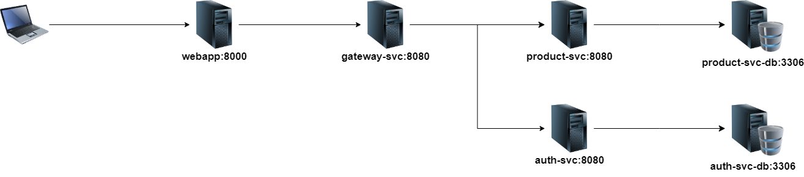

# Shop Microservices

## Structure
- **Web application** - frontend application
- **API Gateway** — routing and load-balancing
- **Auth Service** — microservice for authentication
- **Auth Service DB** — Mysql db for Auth microservice
- **Product Service** — microservice with products business logic
- **Product Service DB** — Mysql db for Product microservice

