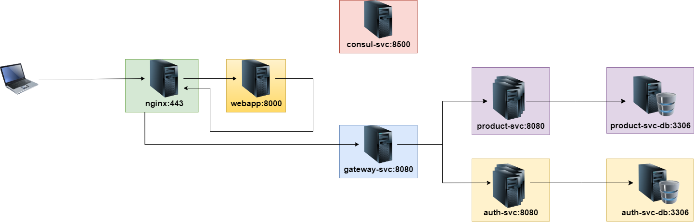

# Shop Microservices

## Structure
- **Nginx Reverse-proxy** - lb entry point to frontend and api-gateway
- **Web application** - frontend application
- **API Gateway** — routing and security
- **Consul** — Service discovery
- **Auth Service** — microservice for authentication
- **Auth Service DB** — Mysql db for Auth microservice
- **Product Service** — microservice with products business logic
- **Product Service DB** — Mysql db for Product microservice

# Installation

## Clone the Repository

```bash
git clone --recurse-submodules git@github.com:f3d-shop-microservices/main-repo.git
```

---

## Requirements

Make sure you have the following installed on your machine:

- PHP 8.1
- Composer
- OpenSSL
- Make

---

## Init project

```bash
make init
```

## Make first test run

```bash
make start PROD=true
```

---

## Modify Your Hosts File

Add the following entries to your `/etc/hosts` file:

```text
127.0.0.1   front.shopmicro.local  
127.0.0.1   api.shopmicro.local
```

> 💡 *You may need administrator privileges to edit this file.*

---

## Enjoy!

You're all set. Go to https://front.shopmicro.local and have fun using the project!